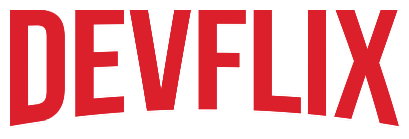

  

Aplicação desenvolvida durante o evento Imersão React da Aura.

## A Aplicação
É um agregador de vídeos do YouTube, onde é possível cadastar os videos e organizá-los em categorias personalizadas. Com um design baseado na Netflix, a proposta aqui é agregar vídeos relacionados ao mundo da programação e tecnologia.

## Features para Implementar
- Cadastro de categorias
- Exclusão de vídeos e categorias
- Resposta ao usuário de sucesso ou erro nos cadastros e exclusões

## :computer: Tecnologias
- HTML
- CSS
- React
- JSON Server
- Styled Components

## Deploy
https://devflix-gamma.vercel.app/
